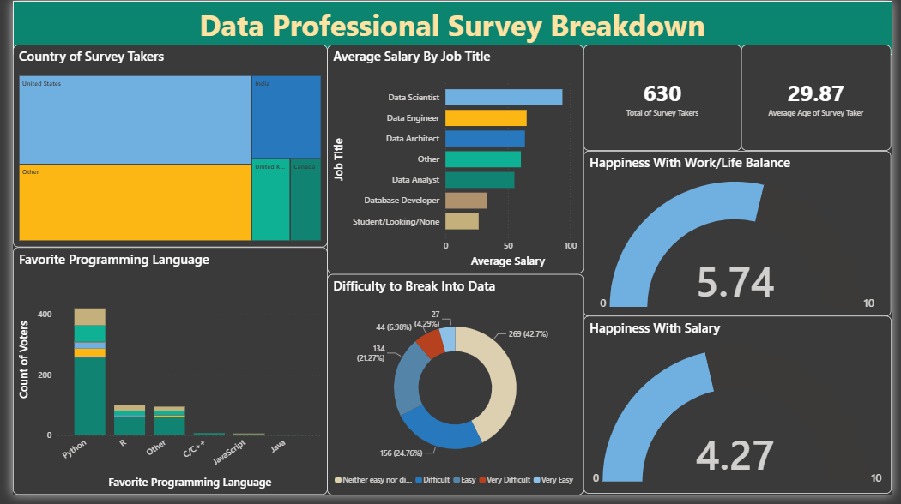

# Data Professional Survey Breakdown

An interactive Power BI dashboard analyzing career demographics, compensation, job satisfaction, and programming language preferences across data professionals worldwide.

---

## 📸 Dashboard Preview



---

## 📊 Overview

This project visualizes survey data collected from data professionals across various roles (Data Scientists, Data Engineers, Data Analysts, Data Architects, etc.). The dashboard uncovers industry insights regarding compensation benchmarks, career transition difficulty, programming tool adoption, and overall work/life satisfaction.

---

## 🔑 Key Insights & Metrics

* **Total Survey Respondents:** 630 professionals with an average age of ~30 years old.
* **Top Programming Languages:** Python dominates as the primary favorite language across roles, followed by R and other tools.
* **Compensation by Role:** Data Scientists and Data Engineers report the highest average compensation bands.
* **Work/Life & Salary Satisfaction:** Gauged on a 1–10 scale:
  * *Work/Life Balance:* Rated moderately positive (~5.74 / 10).
  * *Salary Satisfaction:* Lower relative sentiment (~4.27 / 10).
* **Industry Accessibility:** Breakdown of perceived difficulty transitioning into data careers (ranging from Easy to Very Difficult).

---

## 🛠️ Visuals & Architecture

| Visual Element | Metric / Dimension Analyzed |
| :--- | :--- |
| **Treemap** | Geographic distribution of respondents (Country of Survey Takers) |
| **Horizontal Bar Chart** | Average Salary by Job Title |
| **Stacked Column Chart** | Favorite Programming Language segmented by role |
| **Donut Chart** | Perceived difficulty to break into the data field |
| **Gauge Charts** | Average Work/Life Balance and Salary Happiness scores |
| **KPI Cards** | Total Survey Takers and Average Age |

---

## 🚀 Tech Stack & Tools

* **Business Intelligence:** Microsoft Power BI Desktop
* **Data Processing & Modeling:** Power Query, DAX
* **Data Source:** Data Professional Survey Dataset (`data.xlsx`)

---

## 📂 Project Structure

```text
├── Data Professional Survey Dashboard Project.pbix
├── dashboard_preview.png
├── data.xlsx
└── README.md
```

---

## ⚙️ How to Run

### Option 1: View Locally in Power BI Desktop
1. Clone the repository:
   ```bash
   git clone [https://github.com/gjiajanelle/data-professional-survey-dashboard.git](https://github.com/gjiajanelle/data-professional-survey-dashboard.git)
   ```
   *(Or click the green **Code** button at the top right of this repository and select **Download ZIP**).*
2. Ensure you have **[Power BI Desktop](https://powerbi.microsoft.com/desktop/)** installed on your machine.
3. Double-click and open the file:
   ```text
   Data Professional Survey Dashboard Project.pbix
   ```
4. Click on any chart element (e.g., country tile, job title bar, or programming language column) to explore interactive cross-filtering across the entire dashboard.

---

### Option 2: Explore the Dataset
* Open `data.xlsx` in Microsoft Excel, Google Sheets, or any spreadsheet tool to inspect the raw survey responses and data fields.

### Option 2: Explore the Dataset
* Open `data.xlsx` in Microsoft Excel, Google Sheets, or any spreadsheet tool to inspect the raw survey responses and data fields.
